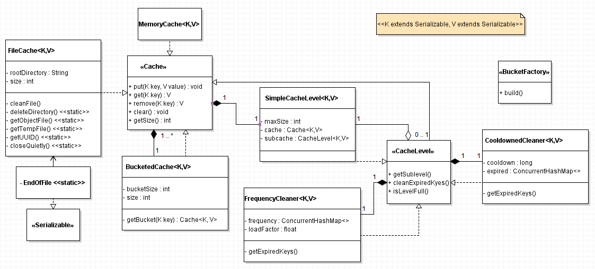
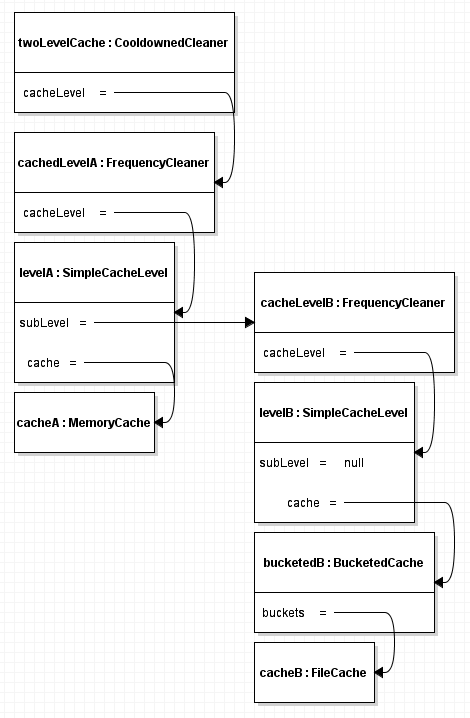

# Постановка задачи
Требуется реализация двух уровнего кеша:
- Кеш первого уровня в оперативной памяти.
- Кеш второго уровня на жестком диске в виде файлов

При заполнении кеша первого уровня происходит вытеснение объектов в кеш второго уровня.
Условия вытеснения объектов:
- Объект не запрашивали более одной секунды.
- Объект запрашивали реже чем другие объекты.

Обеспечить работу в многопоточной среде.

# Анализ

Любой объект кеш (далее Cache) должен обладать следующей функциональностью:
 - добавить объект
 - удалить объект
 - получить объект
 - получить количество кешированных объектов
 - очистить Cache

для реализации требований задачи необходимы два типа Cache:
 - в оперативной памяти
 - на жестком диске

Первый (далее MemoryCache) можно реализовать создав обертку над любой реализацией Map
(выберем ConcurrentHashMap).

Конечный вариант модели классов:

Для реализации второго (далее FileCache) типа требуется наложить ограничения на
хранимые объекты и ключи, а именно потребовать реализацию интерфейса Serializable
(Можно не требовать этого в общем случае от Cache).

Для уменьшения количества блокировок потоками объекта FileCache при использовании
введем обертку для нескольких объектов Cache (далее корзины) которая будет распределять
кешируемые объекты по хешзначению ключа в корзины.

Для реализации нескольких связанных уровней кеша (далее CacheLevel) потребуем от объектов
реализацию дополнительного функционала:
 - получить CacheLevel уровня ниже
 - проверить есть ли место
 - получить количество элементов CacheLevel без учета элементов CacheLevel уровня ниже
 - переместить объекты в CacheLevel уровня ниже

Для обеспечения очистки уровня создадим два декоратора CacheLevel:
 - CooldownedCleaner
 - FrequencyCleaner

Объектная модель реализации двухуровневого кеша:

# Использовались

* [Maven](https://maven.apache.org/)
* [junit](https://junit.org/junit5/)

# Автор

* **Николаев А.С.**